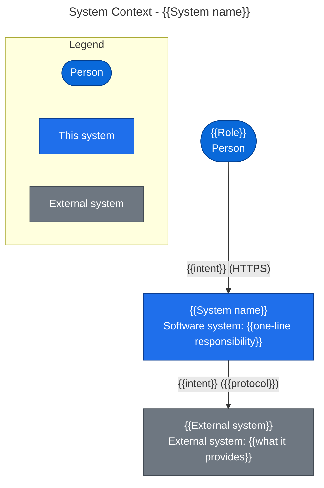
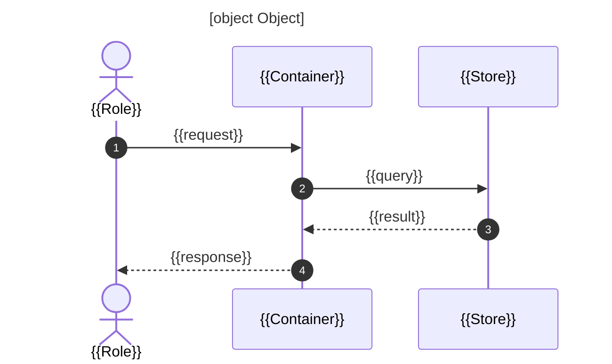

# Architecture: {{System name}}

> Drawn from code by `code-architecture-drawer` on {{YYYY-MM-DD}} at commit `{{short-sha}}`.
> Scope: `{{paths}}` · Mode: {{Quick | Standard | Deep}} · Replace every placeholder before publishing.
>
> Sections follow arc42 (see the mapping in §12). The diagrams follow the C4 model, drawn in Mermaid so they
> render on GitHub. Every element and gap cites the file it came from. Anything the code could not prove is marked
> **Inferred**.

## 1. Summary

{{Two or three sentences: what the system does, for whom, and its architectural style (for example, "a modular
monolith: Laravel API with per-domain modules, one MySQL database, Redis-backed queues").}}

| | |
|---|---|
| Style | {{layered / hexagonal / modular monolith / microservices / serverless / …}}, based on {{evidence}} |
| Languages | {{e.g. TypeScript 82k LOC, Python 4k LOC}} |
| Deployables | {{count and names}} |
| Components | {{count}} · dependency cycles: {{count}} |
| External systems | {{names}} |
| Top gaps | {{GAP-ID}} ({{severity}}), {{GAP-ID}} ({{severity}}), {{GAP-ID}} ({{severity}}) |

## 2. System Context

C4 level 1: the system as one box, the people who use it, and the systems it depends on.



| Element | Type | Responsibility | Evidence |
|---|---|---|---|
| {{name}} | Person / External system | {{what it does for or to the system}} | `{{file}}` |

## 3. Containers

C4 level 2: every separately deployable or runnable unit (apps, APIs, workers, databases, queues), with its
technology and the protocols between them.

```mermaid
{{container diagram: title, legend, every edge labelled with intent and protocol}}
```

| Container | Technology | Responsibility | Entry point | Evidence |
|---|---|---|---|---|
| {{name}} | {{framework, runtime}} | {{one line}} | `{{file}}` | `{{file}}` |

## 4. Components

C4 level 3, one diagram per container that matters. Edge labels are import counts from the dependency graph.
Red marks a dependency cycle.

### 4.1 {{Container name}}

```mermaid
{{component diagram from scan-architecture.py --scope <path> --mermaid components, refined}}
```

| Component | Responsibility | Layer | Files | Ca | Ce | I | Evidence |
|---|---|---|---:|---:|---:|---:|---|
| {{name}} | {{one line}} | {{layer or —}} | {{n}} | {{n}} | {{n}} | {{0.00}} | `{{path}}` |

## 5. Runtime Flows

C4 dynamic view: the one to three flows that carry the most business value or risk, traced through the code.

### 5.1 {{Flow name}}



Traced through: `{{file:line}}` → `{{file:line}}` → `{{file:line}}`.

## 6. Data

{{Stores, what each owns, and who writes to it. Include an erDiagram when a schema exists (Prisma schema,
migrations, ORM models); otherwise list the stores and write "No schema in the repository".}}

## 7. Deployment

{{Deployment diagram from Docker Compose, Kubernetes, IaC, or platform config. If none exists, write "Not
determinable from code" and name what was searched.}}

## 8. Crosscutting Concepts

| Concern | How the code handles it | Evidence |
|---|---|---|
| Authentication and authorization | {{…}} | `{{file}}` |
| Configuration and secrets | {{…}} | `{{file}}` |
| Logging, metrics, tracing | {{…}} | `{{file}}` |
| Error handling | {{…}} | `{{file}}` |
| Caching | {{…}} | `{{file}}` |
| Background work and scheduling | {{…}} | `{{file}}` |

## 9. Architecture Decisions

{{List the ADRs found (path, title, status). If there are none, list the three to five decisions visible in the
code, marked **Inferred**, as candidates for the first ADRs.}}

| Decision | Status | Evidence |
|---|---|---|
| {{e.g. "One MySQL database shared by all modules"}} | Recorded / **Inferred** | `{{file}}` |

## 10. Architecture Gaps

Every gap cites the standard it measures against and the file that proves it. Confidence is **Confirmed** when
the evidence was opened and read, and **Likely** when it rests on the scan alone.

| ID | Severity | Gap | Evidence | Standard | Fix | Confidence |
|---|---|---|---|---|---|---|
| {{GAP-ID}} | {{Critical/High/Medium/Low/Info}} | {{one line}} | `{{file:line}}` | {{standard}} | {{one line}} | {{Confirmed/Likely}} |

### {{GAP-ID}}: {{title}}

- **Evidence:** {{what was found, where}}
- **Why it matters:** {{impact on change, reliability, security, or cost}}
- **Standard:** {{name, section, link}}
- **Fix:** {{concrete change, with a starter config or snippet when one exists}}
- **Verify:** {{the command or check that shows it is fixed}}

## 11. Standards Scorecard

| Standard | Status | Evidence |
|---|---|---|
| C4 model: context, container, and component views exist | {{Pass / Partial / Gap / Not assessed}} | {{evidence}} |
| ADP: no cycles between components | {{…}} | {{…}} |
| Dependency rule / layering | {{…}} | {{…}} |
| Architecture decisions recorded (arc42 §9, ADRs) | {{…}} | {{…}} |
| Architecture rules enforced in CI (fitness functions) | {{…}} | {{…}} |
| Twelve-Factor III: config in the environment | {{…}} | {{…}} |
| Observability (OpenTelemetry or equivalent) | {{…}} | {{…}} |
| API contract (OpenAPI / AsyncAPI / schema) | {{…}} | {{…}} |
| Health endpoints and probes | {{…}} | {{…}} |
| ISO/IEC 25010 maintainability: modularity, testability | {{…}} | {{…}} |

## 12. Method and Limits

- **Scanned:** {{files, languages, LOC}} with `scan-architecture.py` (component depth {{n}}).
- **Read:** {{the files opened to confirm flows and gaps}}.
- **arc42 mapping:** §1 → arc42 1 · §2 → 3 · §3–4 → 5 · §5 → 6 · §7 → 7 · §8 → 8 · §9 → 9 · §10 → 11 ·
  §11 → 10.
- **Not assessed:** {{e.g. runtime configuration, infrastructure outside the repo, dynamic imports, DI container
  wiring, reflection-based routing}}.
- **Inferred:** {{every element or decision marked Inferred above, in one list}}.
