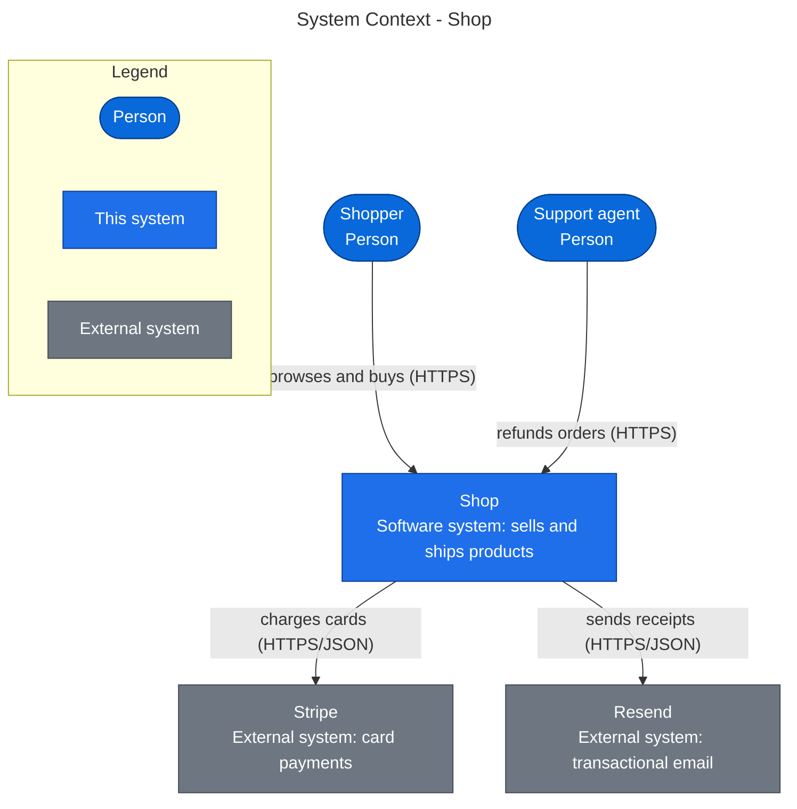
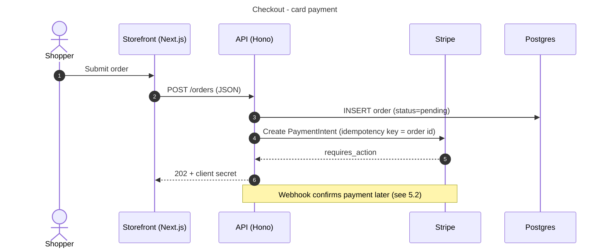
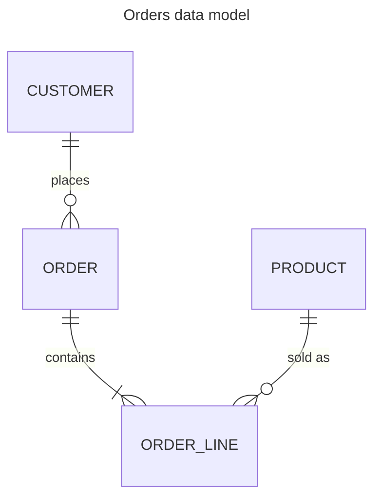

# Diagram guide

How to draw each view so it renders on GitHub, reads in light and dark themes, and passes the C4 notation checklist.

## Tooling choice: Mermaid flowcharts

GitHub renders Mermaid inside ` ```mermaid ` fences in Markdown files, issues, pull requests, discussions, and
wikis. <https://docs.github.com/en/get-started/writing-on-github/working-with-advanced-formatting/creating-diagrams>.
It does not render PlantUML, C4-PlantUML, Structurizr DSL, or D2. So:

- **C4 levels 1–3 and deployment:** `flowchart`, with subgraphs for boundaries and `classDef` for element types.
- **Runtime flows (C4 dynamic view):** `sequenceDiagram`.
- **Data:** `erDiagram`.

**Avoid these unless the user asks for them:**

- Mermaid's C4 diagrams (`C4Context`, `C4Container`, …). The Mermaid docs call them "an experimental diagram
  for now". Layout follows statement order only, and **legends are not supported**, which breaks a C4 notation
  rule. <https://mermaid.js.org/syntax/c4.html>
- `architecture-beta`. It ships with only five built-in icons and can overlap nodes.
- Syntax newer than GitHub is known to render: the `@{ shape: … }` node syntax (v11.3+), and Mermaid 12
  defaults. Mermaid 12.0 (September 2026) made ELK the default layout and changed the default look. To see
  GitHub's version, render a block that contains only `info`.

If a user wants C4-PlantUML or Structurizr as well, generate it as an extra file. The Mermaid diagrams stay the
source of truth in the Markdown.

## Rules for every diagram

1. **A title** in front matter: `---` / `title: Containers - Shop` / `---`. Sequence diagrams may use the `title`
   keyword instead.
2. **A legend** on every C4-style flowchart: a `subgraph Legend["Legend"]` with one sample node per class used.
3. **Every element shows its name, type, and technology**, for example
   `web["Storefront<br/>Container: Next.js 15"]`. Use `<br/>` only: GitHub may strip `<small>` and other tags.
4. **Every relationship is labelled with its intent and, between containers, its protocol**, for example
   `web -->|"reads and writes (SQL/TLS)"| db`. Never an unlabelled arrow in a context, container, or deployment
   view.
5. **One direction per arrow**, pointing from the caller to the callee (or from the dependent to the dependency).
6. **Size limits:** Mermaid's defaults are `maxTextSize` 50,000 characters and `maxEdges` 500. Stay far below
   both. Past about 30 nodes or 60 edges a diagram stops being readable. Split it by container or by layer, or
   collapse the small components (the scanner's `--max-nodes` and `--max-edges` do this).
7. **Colors that work in both themes:** explicit `fill`, `stroke`, *and* `color` in every `classDef`. Never rely
   on the default theme colors. Use the palette below.
8. **Node IDs are short and safe** (`c0`, `web`, `db`). Put spaces and punctuation in the label, never the ID.
   Escape `"` as `#quot;`.

## Palette

The scanner emits the same classes, so hand-drawn and generated diagrams match.

```text
classDef person fill:#0969da,stroke:#033d8b,color:#ffffff   %% people
classDef comp   fill:#1f6feb,stroke:#0b3d91,color:#ffffff   %% this system's containers/components
classDef store  fill:#8250df,stroke:#512a97,color:#ffffff   %% databases, caches, queues
classDef ext    fill:#6e7781,stroke:#424a53,color:#ffffff   %% external systems, out-of-scope nodes
classDef cycle  fill:#cf222e,stroke:#82071e,color:#ffffff   %% in a dependency cycle
classDef other  fill:#afb8c1,stroke:#6e7781,color:#1f2328   %% collapsed or minor nodes
```

Never rely on color alone. The legend names each class, and cycle edges are also thicker (`linkStyle …
stroke-width:2px`).

## Shapes

| Element | Mermaid shape |
|---|---|
| Person | `id(["Name<br/>Person"])` (stadium) |
| Container or component | `id["Name<br/>Container: tech"]` (rectangle) |
| Database, cache, or object store | `id[("Name<br/>PostgreSQL 16")]` (cylinder) |
| Queue or topic | `id[/"Name<br/>RabbitMQ"/]` (parallelogram) |
| External system | rectangle with `class id ext` |
| System boundary | `subgraph SYS["Shop - software system"] … end` |

## Level 1: System Context



## Level 2: Containers

Start from `scan-architecture.py --mermaid containers`. It reads Docker Compose services, the frameworks it
detects, and the external systems it finds. Then refine it:

- Rename the containers to what they are.
- Replace generated intents such as "depends on" with what actually flows.
- Add the protocols.
- Remove anything the code does not prove.

## Level 3: Components

Start from `scan-architecture.py --scope <container path> --mermaid components`. Edge labels are import counts.
Keep them, because they show coupling weight. Red nodes and edges are dependency cycles. Then:

- Merge or rename components so each has one clear responsibility.
- Collapse leaf utilities into one "shared" node if they add noise.
- Keep every cycle edge. Cycles are findings, never clutter.

## Runtime flows (C4 dynamic view)

Trace one flow per diagram through the code, from route to handler to service to store or external call. Cite
the files under the diagram.



## Data

Build the ER diagram from the schema (Prisma `schema.prisma`, migrations, ORM models). Show only the entities that
matter to the flows, not every table.



## Deployment

Draw only what the repository proves: Docker Compose services, Kubernetes manifests, IaC, or platform config
(`vercel.json`, `fly.toml`, `wrangler.toml`). Use nested subgraphs for nodes and environments. If none of that
exists, write "Not determinable from code" and list what you searched. Never draw a guessed cloud.

## Optional exports

- **HTML** with live diagrams, for readers outside GitHub: `python3 scripts/render-html.py ARCHITECTURE.md`.
- **SVG images**, if Node is available and the user wants files:
  `npx -p @mermaid-js/mermaid-cli mmdc -i ARCHITECTURE.md -o ARCHITECTURE.rendered.md`. With Markdown input,
  mermaid-cli writes one SVG per diagram next to the output and links them from it. It downloads a headless
  browser, so ask first.
